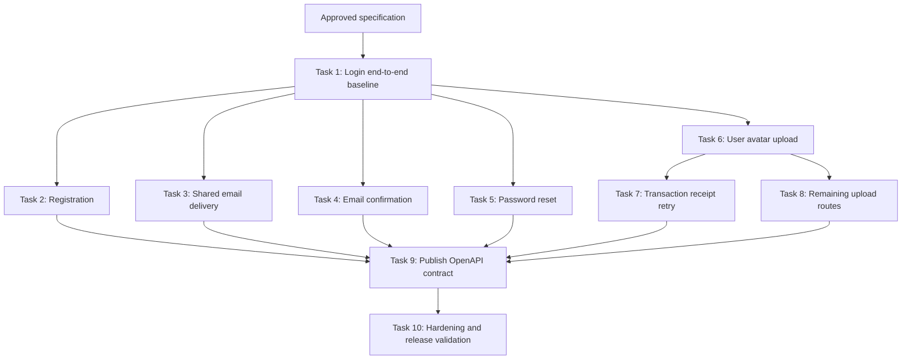

# Rate Limiting Implementation Plan

Status: Implementation in progress; Tasks 1-6 complete
Source: `tasks/spec.md`
Repositories: SplitzBackend and SplitzFrontend
Last updated: 2026-07-12

## Planning Assumptions

- The approved specification is the implementation source of truth. Update implementation status as each validated task completes.
- Production remains one backend process behind an explicitly trusted fixed proxy IP or private CIDR.
- The actual production proxy value is not known yet. Implementation must support deployment configuration with no source-controlled default; production enablement remains blocked until the value is supplied.
- Rate-limit state remains process-local and resets on application restart.
- No new production package is introduced. The only approved package addition is `Microsoft.AspNetCore.Mvc.Testing` `10.0.9` in the backend test project.
- Frontend OpenAPI regeneration uses the existing external `openapi-generator-cli` workflow. Installing or pinning that CLI is not part of this plan.
- Generated OpenAPI files are regenerated once after all protected endpoint metadata is complete, avoiding repeated generated-file churn during earlier slices.

## Implementation Shape

Anonymous account requests use two sequential gates:

```text
trusted client IP
  -> endpoint-selected ASP.NET Core IP policy
  -> model binding
  -> account-group endpoint filter
  -> normalized account/email policy
  -> existing Identity or recovery handler
```

Authenticated uploads use two middleware gates:

```text
authentication
  -> metadata-gated process-wide upload concurrency limiter
  -> endpoint-selected per-user hourly limiter
  -> authorization
  -> existing controller action
```

Endpoint metadata is the shared contract used by enforcement, rejection logging, endpoint inventory tests, and OpenAPI generation.

## Dependency Graph



## Task Summary

| Task | Complete behavior path | Depends on | Primary verification |
| --- | --- | --- | --- |
| 1 | Login is limited by IP and normalized email and shows a client cooldown | Spec approval | Hosted login tests, Vue tests, login E2E |
| 2 | Registration is limited and shows a neutral cooldown | 1 | Hosted registration tests, Vue tests |
| 3 | Resend and password-recovery email routes share one pool and neutral UX | 1 | Cross-route hosted tests, Vue tests, recovery E2E |
| 4 | Confirmation is limited by IP/user ID and offers manual retry | 1 | Hosted confirmation tests, Vue tests, confirmation E2E |
| 5 | Built-in and custom reset routes share one pool and reset UI handles `429` first | 1 | Cross-route hosted tests, Vue tests |
| 6 | User avatar uploads enforce global concurrency and per-user hourly limits with cooldown UX | 1 | Blocking upload integration test, profile test |
| 7 | Transaction receipt retries upload only and never duplicates the transaction | 6 | Receipt integration/component tests |
| 8 | Group avatar and draft receipt join the same upload pools | 6 | Cross-route concurrency and user-isolation tests |
| 9 | Every protected endpoint publishes the `429` contract to the generated client | 2-5, 7-8 | Swagger document test, client regeneration, type-check |
| 10 | Full scope is hardened and ready for production configuration | 9 | Complete backend/frontend validation matrix |

## Task 1: Deliver The Login Rate-Limit Path

**Description:** Implement one complete login path from trusted client address and normalized submitted email through the backend `429` contract to a localized frontend cooldown. This slice establishes the shared infrastructure reused by every later task.

**Dependencies:** Human approval of this plan and the source specification.

**Backend work:**

- Add validated `RateLimitOptions` with every approved default from the specification, including enabled state, proxy trust, all account policy settings, upload settings, and retry fallbacks.
- Register options with `ValidateOnStart`; require trusted proxies/networks only when rate limiting is enabled in Production.
- Add stable policy/category names and endpoint metadata types.
- Add the shared neutral Problem Details rejection writer with delta-seconds `Retry-After`, safe structured logging, and fallback handling.
- Configure forwarded headers from parsed trusted proxy/network values without accepting arbitrary forwarded addresses.
- Add explicit routing, authentication, rate-limiter, and authorization ordering in `Program.cs`; expose `Retry-After` through CORS.
- Register the login IP sliding-window policy and singleton normalized-account limiter.
- Add a route-group endpoint filter that no-ops unless selected account metadata is present, then extracts the already-bound login request, trims and normalizes its email, and acquires the account lease.
- Apply login metadata and the named IP policy to `POST /account/login` through a method-and-route convention on the builder returned by `MapIdentityApi<SplitzUser>()`.
- Make `Program` partial and add a hosted test factory using SQLite, isolated limiter state, test configuration, and replaceable external services.
- Add `Microsoft.AspNetCore.Mvc.Testing` `10.0.9` to `SplitzBackend.Tests`; preserve the existing test SDK unless compilation proves a Web SDK change is required.

**Frontend work:**

- Add `src/libs/rate-limit.ts` to recognize generated `ResponseError` status `429`, parse delta seconds or HTTP dates, and return an absolute expiry with a 60-second fallback.
- Add `src/libs/use-rate-limit-cooldown.ts` using Vue/VueUse timing APIs. It exposes active state and ceiling-rounded remaining seconds, stops on disposal, and never owns or retries API calls.
- Add neutral synchronized English and Simplified Chinese auth countdown messages.
- Give login and resend separate cooldown instances, but activate only the login cooldown in this task.
- Guard both click and form-submit paths while login cooldown is active.
- Ensure login `429` never exposes the resend-confirmation state and non-`429` login behavior remains unchanged.

**Primary files:**

- `SplitzBackend/src/Program.cs`
- `SplitzBackend/appsettings.json`
- `SplitzBackend/src/Services/RateLimiting/*`
- `SplitzBackend/SplitzBackend.Tests/SplitzBackend.Tests.csproj`
- `SplitzBackend/SplitzBackend.Tests/RateLimitOptionsTests.cs`
- `SplitzBackend/SplitzBackend.Tests/RateLimitRejectionWriterTests.cs`
- `SplitzBackend/SplitzBackend.Tests/RateLimitingWebApplicationFactory.cs`
- `SplitzBackend/SplitzBackend.Tests/RateLimitingLoginTests.cs`
- `SplitzFrontend/src/libs/rate-limit.ts`
- `SplitzFrontend/src/libs/use-rate-limit-cooldown.ts`
- `SplitzFrontend/src/libs/__tests__/rate-limit.spec.ts`
- `SplitzFrontend/src/libs/__tests__/use-rate-limit-cooldown.spec.ts`
- `SplitzFrontend/src/pages/LoginPage/LoginPage.vue`
- `SplitzFrontend/src/pages/LoginPage/__tests__/LoginPage.spec.ts`
- `SplitzFrontend/src/locales/en/auth.ftl`
- `SplitzFrontend/src/locales/zh-cn/auth.ftl`
- `SplitzFrontend/e2e/auth-email.spec.ts`

**Acceptance criteria:**

- [x] Checked-in defaults match the specification, including login limits of 20/IP/5 minutes and 10/account/5 minutes with five segments and queue size 0.
- [x] Invalid limits, windows, segment counts, retry values, proxy IPs, and proxy CIDRs fail options validation.
- [x] Production startup fails clearly when rate limiting is enabled without a trusted proxy or network; Development can use the direct connection address.
- [x] Requests below either login limit preserve existing login behavior.
- [x] Exceeding either login limit returns neutral `application/problem+json`, status `429`, code `rate_limit_exceeded`, and a whole-seconds `Retry-After` without executing login.
- [x] Equivalent emails differing by case or surrounding whitespace share one account partition.
- [x] Separate client IP and normalized email partitions remain isolated.
- [x] Untrusted forwarded headers cannot select a client partition.
- [x] The login screen displays a localized live countdown, disables only login submission, re-enables at zero, and never retries automatically.
- [x] Non-`429` login failures retain current behavior.

**Verification:**

- [x] `dotnet test SplitzBackend.Tests/SplitzBackend.Tests.csproj --filter "FullyQualifiedName~RateLimitOptionsTests|FullyQualifiedName~RateLimitRejectionWriterTests|FullyQualifiedName~RateLimitingLoginTests"`
- [x] `bun run test:unit --run src/libs/__tests__/rate-limit.spec.ts src/libs/__tests__/use-rate-limit-cooldown.spec.ts src/pages/LoginPage/__tests__/LoginPage.spec.ts`
- [x] `bun run test:e2e e2e/auth-email.spec.ts --grep "login rate limit"`

## Task 2: Deliver The Registration Rate-Limit Path

**Description:** Apply the established IP/account policy and frontend cooldown contract to registration without changing successful registration or its post-registration capability lookup.

**Dependencies:** Task 1.

**Work:**

- Register the registration IP and normalized-email pools using the approved 10/IP/hour and 6/email/hour defaults.
- Attach registration metadata and the named IP policy to `POST /account/register` through the Identity endpoint convention.
- Extend endpoint inventory tests so the route must carry exactly the registration policy metadata.
- Handle `429` in `RegisterPage.vue`, guard form submission during cooldown, and retain existing handling for success, capability lookup, and non-`429` failures.
- Reuse the shared auth countdown translation rather than creating registration-specific rate-limit semantics.

**Acceptance criteria:**

- [x] Registration requests below threshold preserve existing behavior.
- [x] IP and normalized-email thresholds reject before Identity registration executes.
- [x] Unknown/new emails receive the same neutral rejection contract as any other partition.
- [x] Registration shows the countdown and disables only its submit command until expiry.
- [x] Existing successful registration and generic non-`429` failure tests remain valid.

**Verification:**

- [x] `dotnet test SplitzBackend.Tests/SplitzBackend.Tests.csproj --filter "FullyQualifiedName~RateLimitingRegistrationTests|FullyQualifiedName~RateLimitingEndpointMetadataTests"`
- [x] `bun run test:unit --run src/pages/RegisterPage/__tests__/RegisterPage.spec.ts`

## Task 3: Deliver The Shared Email-Delivery Path

**Description:** Protect resend-confirmation, built-in forgot-password, and custom recovery-request endpoints with one shared IP pool and one shared normalized-email pool, then expose independent resend and recovery cooldowns in the current frontend flows.

**Dependencies:** Task 1.

**Backend work:**

- Register one email-delivery IP limiter and one email-delivery account limiter with approved defaults of 10/IP/hour and 6/email/hour.
- Apply the same logical metadata/pools to:
  - `POST /account/resendConfirmationEmail`
  - `POST /account/forgotPassword`
  - `POST /account/recovery/request`
- Attach metadata directly to the custom recovery route builder and through conventions to generated Identity routes.
- Prove cross-route consumption: requests to one variant reduce the remaining quota on the others.
- Prove known and unknown email requests have indistinguishable rate-limit status, body, headers, and normal timing tolerance.

**Frontend work:**

- Activate the resend-specific cooldown on the login screen independently from login cooldown.
- Add recovery cooldown handling to `ForgotPasswordPage.vue` without moving a rejected request into the submitted-success state.
- Keep form fields editable while only the affected command is disabled.
- Add the recovery `429` browser scenario.

**Acceptance criteria:**

- [x] All three routes share one IP pool and one normalized-email pool.
- [x] The endpoint is not executed after either lease is rejected, preventing email delivery.
- [x] Resend and recovery copy remains neutral and enumeration-resistant.
- [x] Login and resend cooldowns do not disable or reset each other.
- [x] Forgot-password remains on the request form after `429`, shows a live countdown, and requires manual retry.

**Verification:**

- [x] `dotnet test SplitzBackend.Tests/SplitzBackend.Tests.csproj --filter "FullyQualifiedName~RateLimitingEmailDeliveryTests|FullyQualifiedName~RateLimitingEndpointMetadataTests"`
- [x] `bun run test:unit --run src/pages/LoginPage/__tests__/LoginPage.spec.ts src/pages/ForgotPasswordPage/__tests__/ForgotPasswordPage.spec.ts`
- [x] `bun run test:e2e e2e/auth-email.spec.ts --grep "recovery rate limit"`

## Task 4: Deliver The Email-Confirmation Path

**Description:** Limit email-confirmation attempts by client IP and submitted `userId`, while replacing the current misleading expired-link presentation with a rate-limited state and manual retry action.

**Dependencies:** Task 1.

**Backend work:**

- Register confirmation pools with approved defaults of 20/IP/15 minutes and 10/user ID/15 minutes.
- Attach confirmation metadata and IP policy to `GET /account/confirmEmail`.
- Extract a single bound/query `userId` value as the account key without inspecting or logging the confirmation code.
- Cover missing/invalid query behavior separately from throttling behavior.

**Frontend work:**

- Extract the on-mount confirmation request into a reusable function.
- Add a distinct rate-limited state with a live countdown and manual retry button.
- Keep automatic execution only for the initial mount; never retry automatically.
- Preserve existing incomplete-link, success, and ordinary expired/error states.

**Acceptance criteria:**

- [x] Confirmation attempts partition by trusted client IP and submitted `userId`.
- [x] Confirmation codes never enter partition keys or logs.
- [x] A `429` response never renders the expired/invalid-link message.
- [x] Retry remains disabled until countdown expiry and invokes exactly one manual confirmation request afterward.
- [x] Initial mount still confirms valid links automatically once.

**Verification:**

- [x] `dotnet test SplitzBackend.Tests/SplitzBackend.Tests.csproj --filter "FullyQualifiedName~RateLimitingConfirmationTests|FullyQualifiedName~RateLimitingEndpointMetadataTests"`
- [x] `bun run test:unit --run src/pages/ConfirmEmailPage/__tests__/ConfirmEmailPage.spec.ts`
- [x] `bun run test:e2e e2e/auth-email.spec.ts --grep "confirmation rate limit"`

## Task 5: Deliver The Shared Password-Reset Path

**Description:** Protect built-in and custom reset handlers with shared IP and normalized-email quotas, and ensure the current reset UI handles throttling before interpreting validation errors.

**Dependencies:** Task 1.

**Backend work:**

- Register one password-reset IP pool and one normalized-email pool with approved defaults of 20/IP/15 minutes and 10/email/15 minutes.
- Apply them to both:
  - `POST /account/resetPassword`
  - `POST /account/recovery/reset`
- Prove the two routes consume the same logical quotas.
- Ensure reset tokens, new passwords, and error details never enter partition keys or rejection logs.

**Frontend work:**

- Detect `429` before parsing `HttpValidationProblemDetails` in `ResetPasswordPage.vue`.
- Add countdown state and submission guards while preserving mismatch, password-policy, invalid-token, success, and generic error behavior.

**Acceptance criteria:**

- [x] Built-in and custom reset variants share both quota pools.
- [x] Equivalent email spellings share one account partition.
- [x] Rejected requests do not execute password reset logic.
- [x] Reset validation messages remain unchanged for non-`429` responses.
- [x] Rate-limited reset displays neutral countdown copy and requires a manual retry.

**Verification:**

- [x] `dotnet test SplitzBackend.Tests/SplitzBackend.Tests.csproj --filter "FullyQualifiedName~RateLimitingPasswordResetTests|FullyQualifiedName~RateLimitingEndpointMetadataTests"`
- [x] `bun run test:unit --run src/pages/ResetPasswordPage/__tests__/ResetPasswordPage.spec.ts`

## Task 6: Deliver The User-Avatar Upload Path

**Description:** Establish the shared authenticated-upload policy using the current user-avatar endpoint, enforcing both process capacity and per-user fairness and exposing the same countdown contract in the profile UI.

**Dependencies:** Task 1.

**Backend work:**

- Add upload endpoint metadata.
- Add a metadata-gated global limiter that returns a no-op partition for unrelated or unauthenticated endpoints and a single process-wide concurrency limiter for authenticated uploads.
- Add the per-user hourly sliding policy keyed by the stable Identity `NameIdentifier` claim.
- Configure queue size 0, global concurrency 5, hourly limit 200/user, 12 segments, and 5-second fallback when the concurrency lease has no retry metadata.
- Attach both upload gates only to `POST /account/avatar` in this task.
- Replace image storage/processing in hosted tests with a controllable blocking fake so five requests can remain active while a sixth is rejected.
- Verify unauthenticated calls still receive the existing authentication response rather than consuming upload permits.

**Frontend work:**

- Add rate-limit handling to the profile avatar upload action.
- Disable and guard both the visible picker trigger and hidden input activation during cooldown.
- Keep current file-size validation, successful refresh, and non-`429` error handling unchanged.
- Add the first `ProfilePage` component test surface.

**Acceptance criteria:**

- [x] Five authenticated avatar uploads may enter processing; a sixth receives immediate `429` and `Retry-After: 5`.
- [x] The 201st rolling-hour upload for one user is rejected while another authenticated user retains an independent quota.
- [x] Non-upload endpoints do not consume the global upload limiter.
- [x] Unauthenticated avatar requests preserve the existing auth response.
- [x] Profile UI shows a countdown and cannot reopen the file picker during cooldown.

**Verification:**

- [x] `dotnet test SplitzBackend.Tests/SplitzBackend.Tests.csproj --filter "FullyQualifiedName~RateLimitingAvatarUploadTests|FullyQualifiedName~RateLimitingEndpointMetadataTests"`
- [x] `bun run test:unit --run src/pages/ProfilePage/__tests__/ProfilePage.spec.ts`

## Task 7: Deliver The Transaction-Receipt Retry Path

**Description:** Add transaction-receipt uploads to the shared backend pools and make a rejected receipt upload retry only the image operation, preserving the already-created transaction and selected file.

**Dependencies:** Task 6.

**Backend work:**

- Attach upload metadata and the per-user hourly policy to `POST /transaction/{id}/receipt`.
- Verify avatar and transaction-receipt requests share the same process-wide concurrency pool and each user's hourly pool.
- Preserve current ownership, request-size, image validation, and storage behavior after leases are acquired.

**Frontend work:**

- Refactor `AddExpenseDetailsSheet.vue` into explicit save-transaction and pending-receipt-upload phases.
- Retain the created transaction ID and selected `File` after a receipt `429` while the component remains active.
- On manual retry after cooldown, invoke `uploadTransactionReceipt` only; do not call `saveTransaction` again.
- Disable the save/upload command and receipt-picker actions during cooldown while preserving the preview and pending file.
- Add a colocated component test proving one transaction save followed by multiple upload attempts and no duplicate creation.

**Acceptance criteria:**

- [ ] Receipt upload shares avatar upload limits.
- [ ] A rate-limited receipt leaves the transaction and selected receipt intact.
- [ ] Manual retry calls transaction save exactly once and receipt upload again.
- [ ] Successful retry closes the sheet through the existing success path.
- [ ] Non-`429` save and upload errors retain current generic reporting behavior.

**Verification:**

- [ ] `dotnet test SplitzBackend.Tests/SplitzBackend.Tests.csproj --filter "FullyQualifiedName~RateLimitingTransactionReceiptTests|FullyQualifiedName~RateLimitingEndpointMetadataTests"`
- [ ] `bun run test:unit --run src/pages/NewExpensePage/ReviewAndCompletePage/__tests__/AddExpenseDetailsSheet.spec.ts`

## Task 8: Complete The Shared Upload Pools

**Description:** Add group-avatar and transaction-draft receipt endpoints to the existing upload pools and prove the process-wide cap and per-user hourly quota operate across all four backend routes.

**Dependencies:** Task 6. This task may proceed in parallel with Task 7 on an isolated branch, but both touch shared endpoint metadata tests and require coordinated merging.

**Work:**

- Attach upload metadata and the per-user hourly policy to:
  - `POST /group/{groupId}/avatar`
  - `POST /transactiondraft/{id}/receipt`
- Seed the minimum owned group, transaction, and draft graph needed by hosted tests.
- Hold five in-flight operations distributed across the four upload routes and prove the sixth request to any protected route is rejected.
- Prove all four routes consume one user's shared hourly pool and another user remains isolated.
- Add an exact endpoint inventory assertion proving no unrelated controller action carries upload metadata.
- Do not add frontend group-avatar or draft-receipt UI, which remains out of scope.

**Acceptance criteria:**

- [ ] Exactly the four specified upload actions are protected.
- [ ] Global concurrency is process-wide across all four routes, not per route or per user.
- [ ] Hourly upload quota is shared across all four routes for one user and isolated between users.
- [ ] Existing authorization and ownership failures remain unchanged when a lease is available.

**Verification:**

- [ ] `dotnet test SplitzBackend.Tests/SplitzBackend.Tests.csproj --filter "FullyQualifiedName~RateLimitingUploadPoolTests|FullyQualifiedName~RateLimitingEndpointMetadataTests"`

## Task 9: Publish The Rate-Limit API Contract

**Description:** Make the completed protected endpoint inventory discoverable through Swashbuckle and regenerate the frontend client once, after all backend metadata is stable.

**Dependencies:** Tasks 2, 3, 4, 5, 7, and 8.

**Work:**

- Add and register `RateLimitResponseOperationFilter` using `ApiDescription.ActionDescriptor.EndpointMetadata` so it works for both minimal Identity endpoints and controller actions.
- Add `429`, `application/problem+json`, the existing `ProblemDetails` schema, and `Retry-After` response-header documentation to exactly the protected endpoints.
- Test the generated document through `ISwaggerProvider.GetSwagger("v1")`; do not depend on production HTTP exposure of OpenAPI.
- Start the backend in Development with safe local configuration and regenerate `SplitzFrontend/src/backend/openapi` using the README command.
- Review generated changes for protected endpoint docs only; do not manually edit generated output.
- Confirm generated success method signatures remain unchanged and frontend handling continues through `ResponseError`.

**Acceptance criteria:**

- [ ] Every protected account and upload endpoint documents the `429` Problem Details response and `Retry-After` header.
- [ ] Out-of-scope endpoints do not gain rate-limit response documentation.
- [ ] Frontend generated files are reproducible from backend `/openapi/v1.json`.
- [ ] Frontend type-check passes without application changes to generated code.

**Verification:**

- [ ] `dotnet test SplitzBackend.Tests/SplitzBackend.Tests.csproj --filter "FullyQualifiedName~RateLimitOpenApiTests|FullyQualifiedName~RateLimitingEndpointMetadataTests"`
- [ ] `bun run type-check`
- [ ] `git diff --check` in both repositories

## Task 10: Harden And Validate The Release

**Description:** Close integration gaps across all slices, run the complete validation matrix, and leave production enablement gated only by the explicit trusted-proxy deployment value.

**Dependencies:** Task 9 and completion of all feature slices.

**Work:**

- Run the full endpoint inventory and threshold matrix using fresh factories so singleton limiter state cannot leak between tests.
- Verify every application-generated `429` has neutral Problem Details, `Retry-After`, safe logs, and browser-visible CORS exposure.
- Verify concurrency rejections log `global` and sliding upload rejections log `user` without logging partition values. Use lease metadata presence and the configured concurrency fallback as the discriminating behavior, covered by tests.
- Verify disabled rate limiting bypasses enforcement without causing missing-policy failures.
- Verify application restarts reset process-local counters and document that behavior in implementation notes if needed.
- Run formatting, linting, type checks, unit tests, hosted integration tests, and Playwright tests.
- Review diffs for accidental generated, lockfile, credential, or unrelated changes.
- Update the specification status to approved/implemented only after human confirmation.
- Record the trusted proxy IP/CIDR as a deployment prerequisite; do not invent or commit a value.

**Acceptance criteria:**

- [ ] All 16 specification acceptance criteria have corresponding automated coverage or an explicit deployment verification step.
- [ ] Backend and frontend validation commands pass.
- [ ] No secrets, raw emails, account keys, client partition values, passwords, confirmation codes, or reset codes appear in logs or committed fixtures.
- [ ] No endpoint outside the approved scope is limited or documents `429`.
- [ ] Production enablement remains blocked until the real trusted proxy/network value is configured.

**Verification:**

- [ ] `dotnet test SplitzBackend.sln`
- [ ] `dotnet build SplitzBackend.sln`
- [ ] `dotnet format SplitzBackend.sln --verify-no-changes`
- [ ] `bun run type-check`
- [ ] `bun run test:unit --run`
- [ ] `bun run test:e2e e2e/auth-email.spec.ts`
- [ ] `bun run lint`
- [ ] `bun run format:check`
- [ ] `git diff --check` in both repositories

## Parallelization And Coordination

- Task 1 is the required sequential foundation.
- Tasks 2 through 5 are behaviorally independent after Task 1, but they all touch the Identity endpoint convention, endpoint inventory tests, and auth locale files. They may run in parallel only on isolated branches with an intentional merge owner; in one working tree, execute them sequentially.
- Task 6 can run in parallel with Tasks 2 through 5 after Task 1 because it primarily touches upload policy code, profile UI, and upload tests. Coordinate shared options and rejection-writer changes.
- Tasks 7 and 8 may run in parallel after Task 6. Coordinate upload metadata inventory tests.
- Task 9 must wait until endpoint metadata is stable.
- Task 10 is sequential and final.

## Human Review Checkpoint

Before implementation begins, confirm:

- The task order and vertical slices are acceptable.
- The plan may treat `tasks/spec.md` as approved and update its status during implementation.
- Production remains blocked until the actual trusted proxy IP/CIDR is supplied through deployment configuration.
- Deferring OpenAPI regeneration until all backend endpoint metadata is complete is acceptable.
